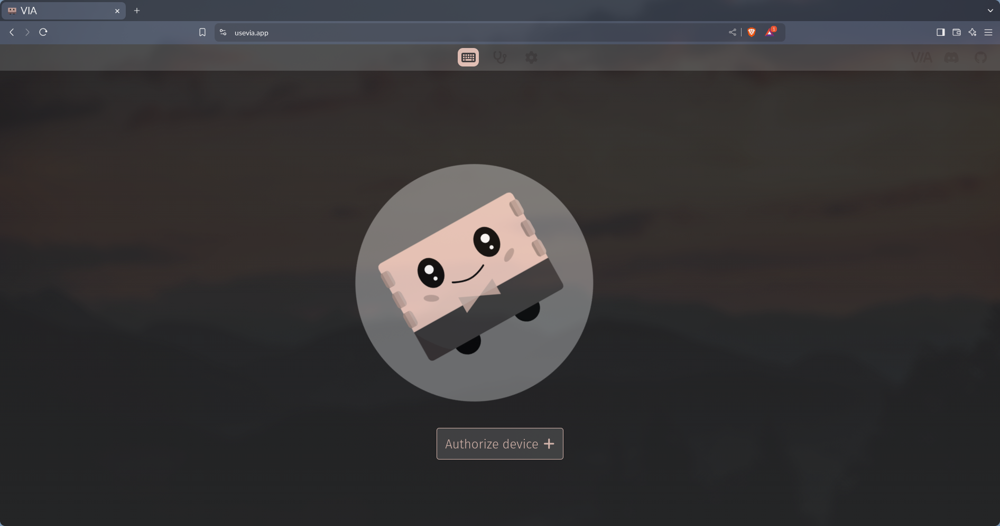
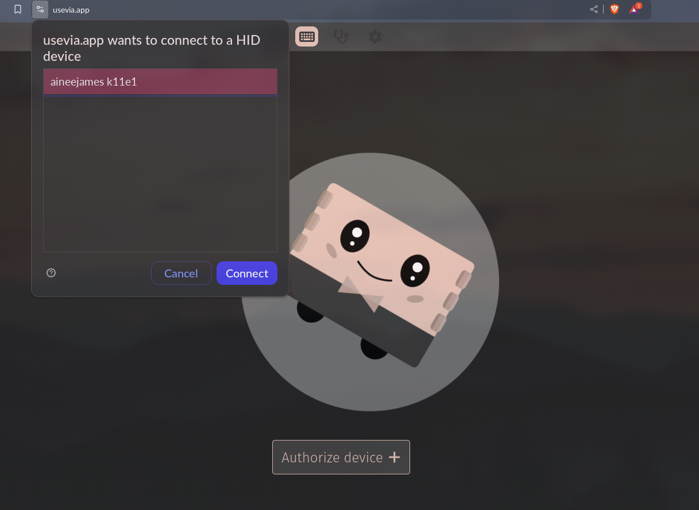
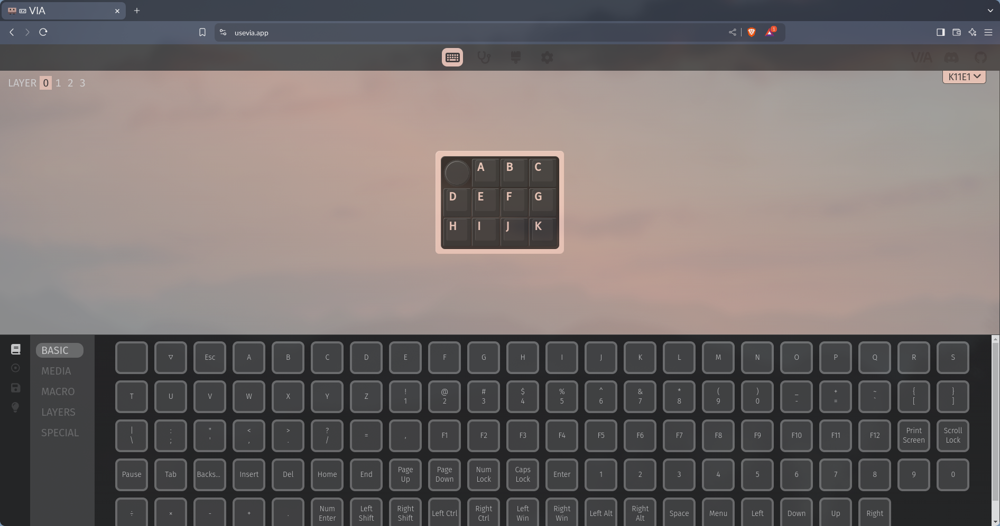

# instrukcja konfiguracji do macropada k11e1

1. otwórz przeglądarkę i wejdź na stronę <https://usevia.app/>
    
1. z przycisków na górze wybierz ustawienia
1. zaznacz opcję "show design tab"
1. teraz wybierz opcję "design" z przycisków na górzę (ikona pędzla)
1. dodaj plik (poprzez przesunięcie albo kliknij "upload") `via.json`
1. teraz kliknij przycisk "configure" (ikona klawiatury)
1. kliknij "authorize device" i wybierz opcję "k11e1" (lub "aineejames k11e1")
    
1. teraz możesz już konfigurować dowolny przcisk jak i pokrętło (je też można kliknąć!)
    
